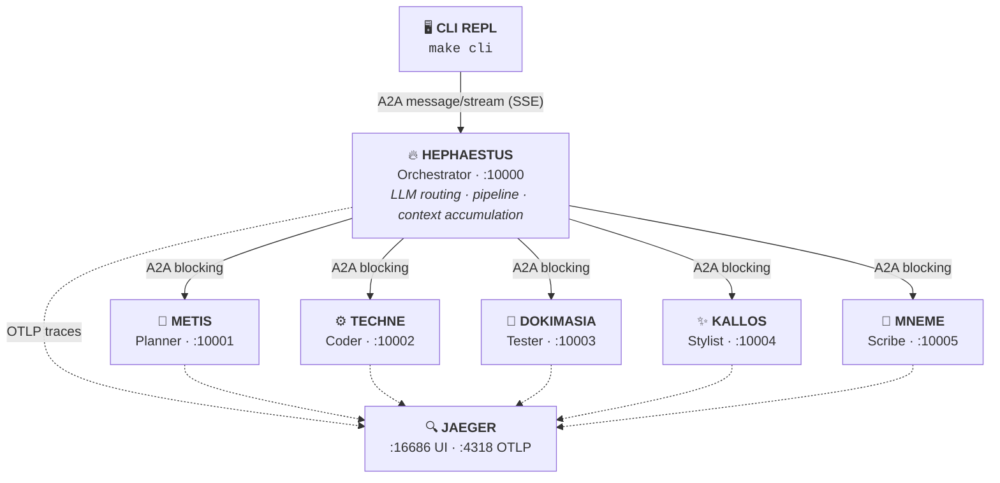

# Architecture

## 🗺️ System Diagram



---

## 🔗 Communication Patterns

### User ↔ Hephaestus: Streaming (SSE)

The CLI connects to Hephaestus using A2A `message/stream` with Server-Sent Events. This means you see real-time progress as each agent reports status — not a single response after everything finishes.

```python
# CLI sends a streaming request
request = SendStreamingMessageRequest(
    id=str(uuid4()),
    params=MessageSendParams(
        message=Message(
            role=Role.user,
            parts=[Part(root=TextPart(text=user_text))],
            context_id=context_id,
        ),
        configuration=MessageSendConfiguration(
            accepted_output_modes=["text"],
        ),
    ),
)

async for result in client.send_message_streaming(request):
    # TaskStatusUpdateEvent → progress messages
    # TaskArtifactUpdateEvent → final output
    ...
```

### Hephaestus ↔ Specialists: Synchronous

Hephaestus calls specialists using A2A `message/send` with `blocking=True`. This makes each call synchronous — Hephaestus waits for one specialist to complete before calling the next.

```python
# RemoteAgentConnection.send() — simplified
request = SendMessageRequest(
    id=message_id,
    params=MessageSendParams(
        message=Message(
            role=Role.user,
            parts=[Part(root=TextPart(text=user_text))],
            context_id=context_id,
            metadata=get_trace_context(),  # W3C trace headers
        ),
        configuration=MessageSendConfiguration(blocking=True),
    ),
)
response = await client.send_message(request)
```

### Input Required: Clarification Loop

When a specialist needs user input, it raises `AgentInputRequired`. Hephaestus catches this and yields an `INPUT_REQUIRED:` status. The CLI detects this state and prompts the user for follow-up, then resends to continue the pipeline.
