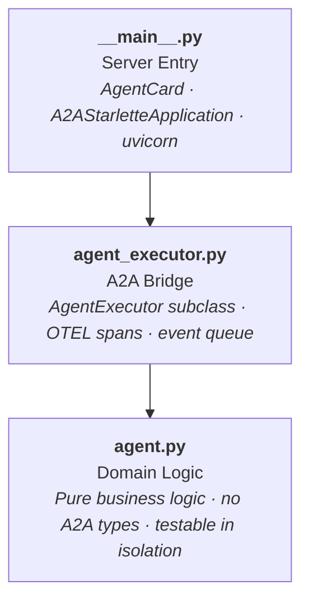

# Internals

## 🏗️ Three-Layer Agent Pattern

Every agent follows the same internal structure. No exceptions.



| Layer | File | Responsibility |
|---|---|---|
| **Server entry** | `__main__.py` | Defines the `AgentCard`, creates the `A2AStarletteApplication`, starts uvicorn. |
| **A2A bridge** | `agent_executor.py` | Subclasses `AgentExecutor` from `a2a-sdk`. Translates between A2A events and domain logic. Creates OTEL spans. |
| **Domain logic** | `agent.py` | Pure business logic. No A2A types. Async functions and generators. Testable in isolation. |

**Why this matters:**

- `agent.py` never imports `a2a.*` — you can test all business logic with simple function calls and mocked LLM responses
- `agent_executor.py` is the only file that touches A2A types — protocol changes are contained to one layer
- `__main__.py` owns configuration — if you need to change ports, skills, or card metadata, it's all in one place

### Example: Mneme's Three Layers

```python
# agent.py — pure logic, no A2A
async def generate_commit_messages(git_output: str) -> str:
    messages = [
        {"role": "system", "content": SYSTEM_PROMPT},
        {"role": "user", "content": git_output},
    ]
    return await chat("mneme", messages)

# agent_executor.py — A2A bridge
class MnemeAgentExecutor(AgentExecutor):
    async def execute(self, context, event_queue):
        user_input = context.get_user_input()
        task = new_task(context.message)
        await event_queue.enqueue_event(task)
        updater = TaskUpdater(event_queue, task.id, task.context_id)
        await updater.update_status(TaskState.working, new_agent_text_message("Generating commit messages...", ...))
        result = await generate_commit_messages(user_input)
        await updater.add_artifact([Part(root=TextPart(text=result))])
        await updater.complete()

# __main__.py — server config
card = AgentCard(
    name="Mneme",
    description="Generates commit messages from git diff output",
    version="0.1.0",
    skills=[AgentSkill(name="generate_commit_messages", ...)],
    ...
)
app = A2AStarletteApplication(agent_card=card, agent_executor=MnemeAgentExecutor)
```

---

## 📦 Shared Library: `kourai-common`

All agents depend on a shared workspace member at `shared/src/kourai_common/` with four modules:

### `config.py` — Agent Configuration

Centralized model assignments, ports, timeouts, and environment variable handling.

```python
from kourai_common.config import get_model, get_agent_url, MAX_ITERATIONS

get_model("metis")       # → depends on KOURAI_MODEL_TIER; "anthropic/claude-opus-4-6" on smart, Haiku on cheap (default)
get_agent_url("techne")  # → "http://localhost:10002/" (or Docker service name)
```

`KOURAI_AGENT_HOST=true` switches URL resolution from `localhost:PORT` to `servicename:PORT` for Docker networking.

### `llm.py` — Model-Agnostic LLM Interface

Wraps [LiteLLM](https://docs.litellm.ai/) for async-compatible calls with per-agent timeout enforcement.

```python
from kourai_common.llm import chat, chat_stream

# Synchronous response
result = await chat("mneme", messages, temperature=0.3, max_tokens=4096)

# Streaming response
async for chunk in chat_stream("techne", messages):
    yield chunk
```

### `tracing.py` — OpenTelemetry Integration

Sets up distributed tracing with Jaeger as the backend.

```python
from kourai_common.tracing import setup_tracing, create_span, get_trace_context

# Call once at startup
setup_tracing("mneme", otlp_endpoint)

# Create spans around operations
with create_span("mneme.generate", {"input_length": str(len(text))}):
    result = await generate_commit_messages(text)

# Propagate trace context across agent boundaries
metadata = get_trace_context()  # → W3C traceparent/tracestate headers
```

### `retry.py` — Exponential Backoff

Decorator for transient failure recovery on network calls.

```python
from kourai_common.retry import with_retry

@with_retry(max_attempts=3, base_delay=1.0,
            retryable_exceptions=(httpx.ConnectError, httpx.TimeoutException))
async def send(self, text, context_id):
    ...
```

---

## 🧠 Conversational Memory

Kourai Khryseai persists the entire conversation history to a local SQLite database for context, debugging, and A2A state management. It follows a privacy-first, local-only approach.

**Location:** `.cache/agent_memory.db`

The database implements 2026 Best Practices for A2A Memory (Hierarchical State Management) with two primary tables:

- **`messages`**: Episodic/working memory. Stores every single message exchanged, tracking the `context_id` (thread), `agent_name`, `role`, and the raw `content`.
- **`agent_states`**: Semantic memory. Stores structured state objects (goal hierarchies, checkpoints, summaries) for each agent and thread.

> **Visualizing the Database:** The 2026 best practice for debugging these A2A SQLite logs is using a modern database UI like **Beekeeper Studio**, or directly within your IDE using the **SQLite Viewer** extension in VS Code/Cursor. Alternatively, use the CLI: `sqlite3 .cache/agent_memory.db "SELECT role, content FROM messages WHERE agent_name='kallos';"`
