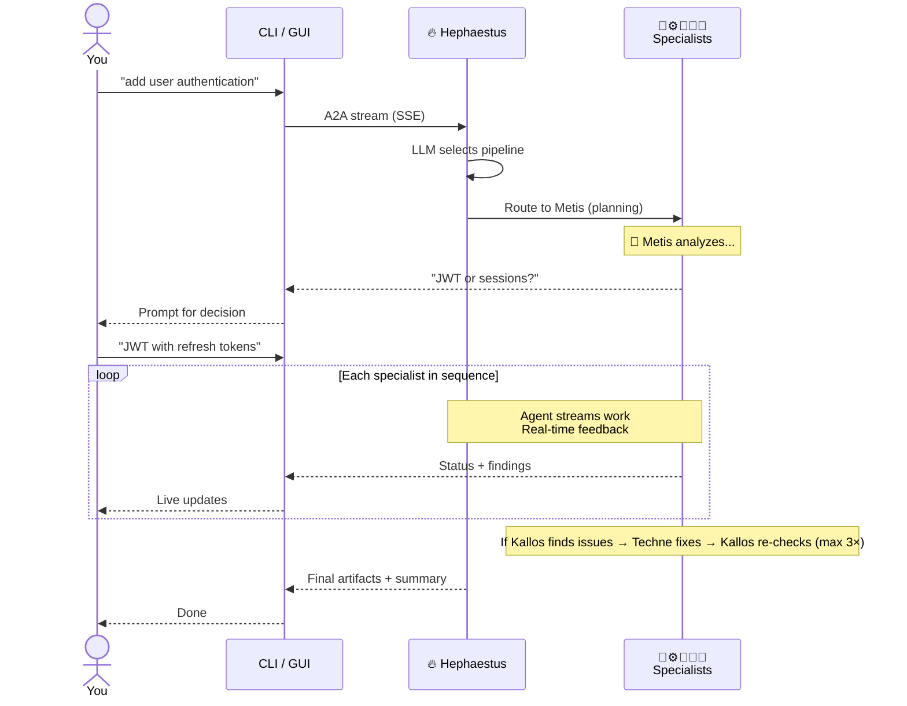

# Overview

## 🏛️ What is Kourai Khryseai?

Kourai Khryseai is an **interactive multi-agent development system** where six specialized AI agents collaborate *with* you on software development. Instead of running autonomously in the background, they stream their work in real-time, show their reasoning, and ask for guidance when decisions matter.

You describe what you need. Agents break it down, show you options, execute your feedback, and iterate based on your input. You're not delegating—you're directing.

---

## 🤝 Why Collaboration, Not Automation?

Single-agent tools struggle with multi-discipline problems. A real development task requires:
- **Planning** — What are we building? What could break?
- **Coding** — Implement the changes cleanly
- **Testing** — Validate behavior and edge cases
- **Review** — Enforce style, catch bugs
- **Documentation** — Document the work

Rather than hoping one model handles all five well, Kourai splits them across **six specialist agents**. Each is focused, uses the right model tier, and communicates its findings back to you.

**Better yet:** You're in the loop. When Metis says "should we use JWT or sessions?", you answer. When Techne hits an ambiguous pattern, they ask. When Kallos finds lint issues, Techne fixes them automatically, then asks if you're satisfied. Nothing surprises you.

---

## 👥 The Specialists

| Agent | Specialty | You'll hear from them when... |
|-------|-----------|------|
| 🔥 **Hephaestus** | Orchestration | Routing requests, managing feedback loops, asking clarifying questions |
| 📐 **Metis** | Planning | Breaking down your goal into specs, identifying edge cases, asking architectural decisions |
| ⚙️ **Techne** | Implementation | Writing code, explaining patterns, asking for clarification on ambiguous requirements |
| 🧪 **Dokimasia** | Testing | Creating test suites, reporting coverage, flagging untested branches |
| ✨ **Kallos** | Quality | Finding style violations, suggesting docstring improvements, asking Techne to fix code issues |
| 📜 **Mneme** | Documentation | Organizing git diffs into conventional commits, formatting commit messages |

Each agent is an independent HTTP server. They communicate via the open [A2A (Agent-to-Agent) protocol](https://a2a-protocol.org), allowing them to be deployed separately, tested independently, or swapped for custom implementations.

---

## 🔄 How a Request Actually Flows

When you ask for something, here's what happens:



**Real conversation example:**

```
❯ add authentication to /api/users

🔥 Hephaestus: Analyzing request...
   → Route: Metis (planning) → Techne (implementation) → Dokimasia (testing) → Kallos (style) → Mneme (commits)

📐 Metis: Spec in progress...
   • Found existing session middleware
   • Should we extend it or use JWT?

❯ JWT with refresh tokens

📐 Metis: Got it. Specification:
   - JWT tokens (15min expiry)
   - Refresh token rotation
   - Rate limiting on token refresh
   - Tests for token expiry and rotation
   ✅ Ready for Techne

⚙️ Techne: Implementing...
   • src/auth/tokens.py — JWT utilities
   • src/api/users.py — Auth middleware
   • Streaming changes...
   ✅ Complete

🧪 Dokimasia: Testing...
   • 8 new unit tests for JWT handling
   • Coverage: 92% (up from 78%)
   • All passing ✅

✨ Kallos: Code review...
   • ruff: all clear ✅
   • Type hints: all clear ✅
   • Docstrings: added 4
   ✅ No issues

📜 Mneme: Commits ready:
   feat(auth): implement JWT authentication
   - Added JWT token generation and validation
   - Added refresh token rotation
   - Files: src/auth/tokens.py, src/api/users.py, tests/...
```

---

## 🎯 Pipelines

Hephaestus automatically routes to the right pipeline:

| Request Type | Pipeline |
|---|---|
| *"implement feature X"* | 📐 → ⚙️ → 🧪 → ✨ → 📜 (Full stack) |
| *"fix bug in X"* | ⚙️ → 🧪 → ✨ → 📜 (No planning needed) |
| *"add tests for X"* | 🧪 → ✨ → 📜 (Testing-focused) |
| *"clean up X"* | ✨ → 📜 (Style only) |
| *"commit prep"* | 📜 (Just organize commits) |
| *"plan feature X"* | 📐 (Planning only) |
| *"@metis, why use async here?"* | 📐 (1-on-1 question) |

---

## 🔄 Human-on-the-Loop (HOTL) Design

Instead of silent automation, agents proactively engage when decisions matter:

**Ambiguous requirements?**
```
📐 Metis: Should CSV export support streaming for large files?
   [A] Yes—use async generator (slower startup, constant memory)
   [B] No—load and write all at once (faster start, high memory)

❯ A
```

**Conflicting linting issues?**
```
✨ Kallos: Found 3 issues:
   1. Line 42: Type hint missing
   2. Line 156: Unused import
   3. Line 89: Docstring too terse

⚙️ Techne: Fixing all 3...
   ✅ Complete

✨ Kallos: Re-checking... All clear!
```

**Nothing gets decided without you.** This prevents wasted tokens on speculation and keeps you in control of trade-offs.

---

## 💻 Access Modes

### CLI (Terminal)

Fast, scriptable, works anywhere (including over SSH). Real-time agent output with emoji progress.

```bash
$ kourai "add pagination to /api/items"

🔥 Hephaestus: Routing...
📐 Metis: Spec drafted...
⚙️ Techne: Writing changes...
🧪 Dokimasia: Testing...
✨ Kallos: Reviewing...
📜 Mneme: Commits ready
```

### GUI (Desktop)

Rich visual experience with agent portraits, dialogue bubbles, and personality-matched voices. Each agent has a distinct voice and visual appearance.

- 🎨 Agent portraits with emojis and color coding
- 💬 Real-time dialogue bubbles with streaming responses
- 🔊 Neural text-to-speech (Microsoft Edge TTS) with volume/pitch control
- ⚙️ Settings for voice customization and accessibility
- 📜 Scrollable chat history per session

---

## 🔧 Built With

<div class="grid cards" markdown>

-   :material-api:{ .lg .middle } **Protocol**

    ---

    [A2A 0.4](https://a2a-protocol.org) — open agent-to-agent communication

-   :material-brain:{ .lg .middle } **LLM**

    ---

    [LiteLLM](https://docs.litellm.ai/) — Claude, Gemini, Ollama, local models

-   :material-language-python:{ .lg .middle } **Language**

    ---

    Python 3.12+ with modern type hints and Google docstrings

-   :material-server:{ .lg .middle } **Server**

    ---

    [Starlette](https://www.starlette.io/) + uvicorn via `a2a-sdk`

-   :material-magnify:{ .lg .middle } **Observability**

    ---

    [OpenTelemetry](https://opentelemetry.io/) → [Jaeger](https://www.jaegertracing.io/) + [Prometheus](https://prometheus.io/)

-   :material-docker:{ .lg .middle } **Containers**

    ---

    Docker + Docker Compose with optional Terraform

-   :material-package-variant:{ .lg .middle } **Packaging**

    ---

    [uv](https://docs.astral.sh/uv/) workspaces with workspace support

-   :material-tools:{ .lg .middle } **Tools**

    ---

    [MCP](https://modelcontextprotocol.io/) servers (filesystem, git, shell)

</div>

---

## 🏛️ The Name

> *In Greek mythology, Hephaestus — god of fire and the forge — crafted the Κοῦραι Χρύσεαι (Golden Maidens): women-shaped automatons of living gold who served as intelligent attendants in his divine workshop. Each could think, speak, and work independently.*

Each agent is named after a Greek concept matching its function:

- **Hephaestus** — The master craftsman, god of the forge
- **Metis** — Goddess of wisdom and craft (mother of Athena)
- **Techne** — Art, craft, and technical skill
- **Dokimasia** — Scrutiny, examination, proof of competence
- **Kallos** — Beauty, elegance, aesthetic form
- **Mneme** — Memory (one of the original three Muses)
