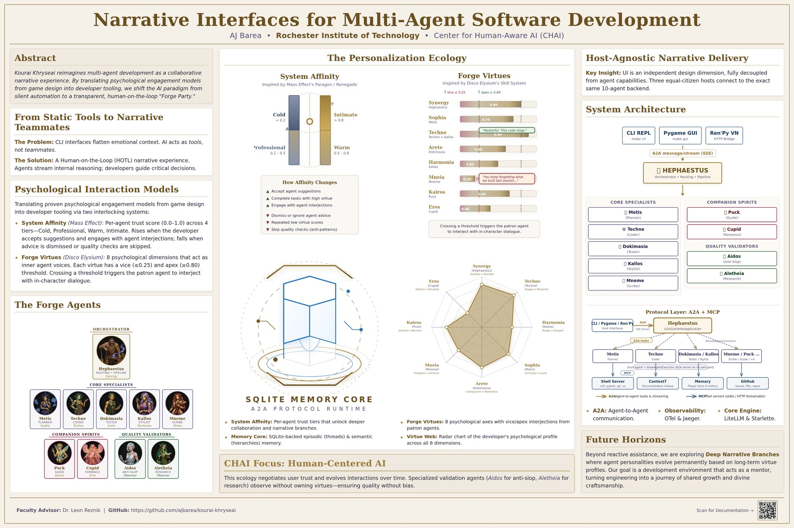

# CHAI 2026 — Narrative Interfaces (Poster)

**Title:** Narrative Interfaces for Kourai Khryseai

**Author:** AJ Barea, Rochester Institute of Technology (`ajb6289@rit.edu`)

**Venue:** CHAI Research Poster Session — RIT Center for Human-aware Artificial Intelligence

**Date:** Wednesday, April 15, 2026 · 9:30 – 10:30 AM

**Location:** Student Innovation Hall 1600 Atrium, RIT — Rochester, NY

**Download:** [narrative-interfaces-poster.pdf](narrative-interfaces-poster.pdf) (36 × 24 in, print quality)

## Summary

Poster on narrative interfaces for agentic systems — exploring how embodiment, voice, and visual-novel framing affect how users supervise and redirect multi-agent software. Directly motivates the three-host design (CLI, GUI, Ren'Py VN) shared across Kourai's orchestration layer.
