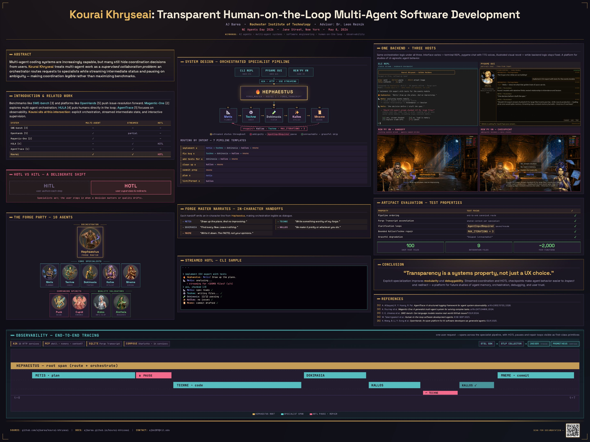

# NE Agents Day 2026 — Kourai Khryseai

**Title:** Kourai Khryseai: Transparent Human-on-the-Loop Multi-Agent Software Development

**Author:** AJ Barea, Rochester Institute of Technology (`ajb6289@rit.edu`)

**Advisor:** Dr. Leon Reznik

**Venue:** North-East AI Agents Day 2026

**Date:** Friday, May 8, 2026

**Location:** Jane Street, New York, NY

**Downloads:**

- [kourai-khryseai-poster.pdf](kourai-khryseai-poster.pdf) — conference poster (48 × 36 in, print quality)
- [kourai-khryseai-extended-abstract.pdf](kourai-khryseai-extended-abstract.pdf) — accepted extended abstract

## Abstract

Multi-agent coding systems are increasingly capable, but many still hide coordination decisions from users. Kourai Khryseai is an interactive software development environment that treats multi-agent work as a supervised collaboration problem. An orchestrator routes requests to specialist agents for planning, coding, testing, style review, and commit synthesis, while agents stream intermediate status and request clarification when requirements are ambiguous. The backend combines independent A2A-connected services, MCP-based tool use, shared local SQLite state, and end-to-end tracing through OpenTelemetry, Jaeger, and Prometheus. The same orchestration layer powers a CLI, desktop GUI, and visual-novel-style interface, enabling studies of interface and embodiment without changing backend logic.

**Keywords:** AI agents, multi-agent systems, software engineering, human-on-the-loop, observability
